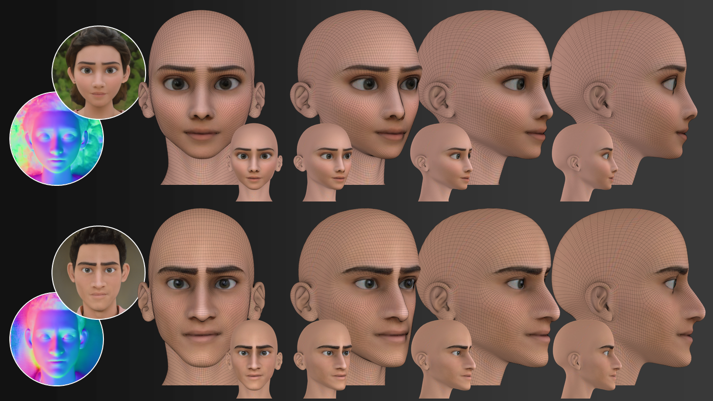

# Toonify3D
[SIGGRAPH 2024] Official implementation of "Toonify3D: StyleGAN-based 3D Stylized Face Generator"

[[Paper]](http://wonjongg.me/assets/pdf/Toonify3D.pdf) [[Project page]](http://wonjongg.me/Toonify3D_pages)



## Update log
- Release training code (9.1.2024)

## Environment
Environment for our project depends on [PTI](https://github.com/danielroich/PTI).

## How to train StyleNormal

### A. Dataset preparation
1. Purchase and download 3D human models from [3DScanstore](https://3dscanstore.com/).
2. Render textured 3D human models under 5 environment light and their surface normal maps using the included Blender file from 3DScanStore.
3. Follow the instruction from [PTI inversion](https://github.com/danielroich/PTI)  and apply PTI inversion on rendered 3D human models.
4. Apply [semantic face segmenation](https://github.com/zllrunning/face-parsing.PyTorch) to obtain facial masks on valid region.

### B. Run training
1. Before running training code, please check whether your dataset preparation is perfect.
2. You should have (1) inverted latent codes of rendered images (2) surface normal images aligned with rendered images (3) inverted model weights for rendered images (4) valid region masks.
3. Please check L112-124 of "train.py" and fill in proper paths for the prepared dataset. In this step, you need to check "dataset.py".
4. Run train.py

## Externals

### Training
🏷️ StyleGAN PTI inversion: https://github.com/danielroich/PTI

### Testing
🏷️ Normal-to-depth: https://github.com/xucao-42/bilateral_normal_integration  
🏷️ Non-rigid template registration: https://github.com/ycjungSubhuman/density-adaptation  
🏷️ Semantic face segmentation: https://github.com/zllrunning/face-parsing.PyTorch  
🏷️ Landmark detection: https://github.com/DefTruth/torchlm  

## License
- This repository for training code is protected under the same license as the official StyleGAN implementation (https://github.com/NVlabs/stylegan2-ada-pytorch.git).
- We cannot distribute our pre-trained model due to license agreement of 3DScanStore. If you need the entire code or runnable program for our project, you can request technology transfer to our university. In this case, please contact us (wonjong@postech.ac.kr).

## Citation
```
@inproceedings{jang2024toonify3d,
  author = {Jang, Wonjong and Jung, Yucheol and Kim, Hyomin and Ju, Gwangjin and Son, Chaewon and Son, Jooeun and Lee, Seungyong},
  title = {Toonify3D: StyleGAN-based 3D Stylized Face Generator},
  booktitle = {ACM SIGGRAPH 2024 Conference Papers}, 
  articleno = {17},
  numpages = {11},
  publisher = {ACM},
  year = {2024}
}
```
